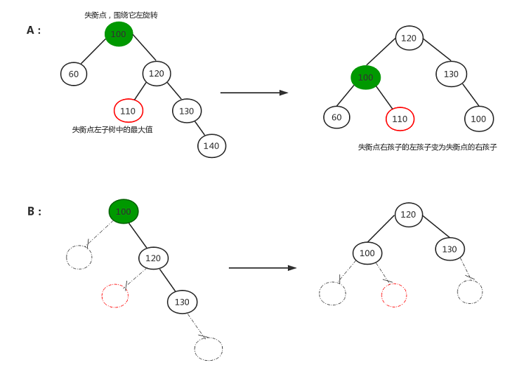
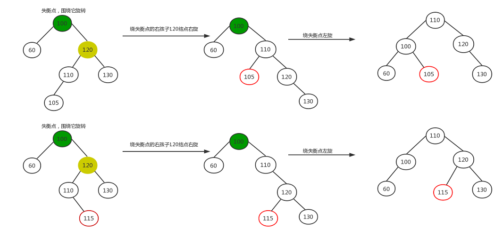
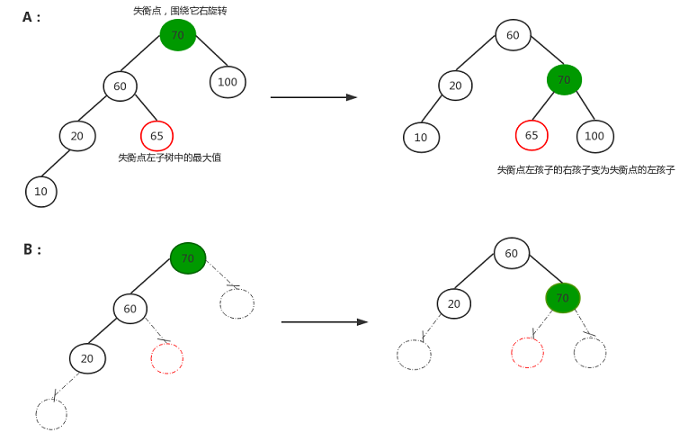
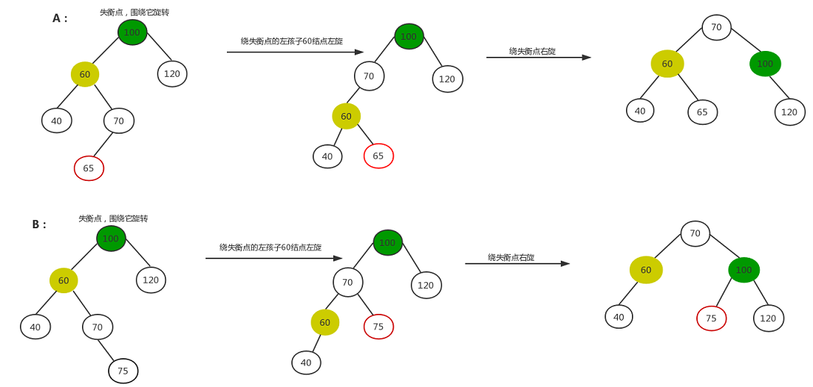

# AVl 树

## 定义
* AVL树是带有平衡条件的二叉搜索树。 其平衡条件为 每个节点的左子树和右子树的高度差最多为1

## 说明
### 插入
平衡二叉树的旋转：有4类，每类中又有两类
+ 左旋转

当插入的结点为失衡点的右子树的右子树中（左右孩子都行），如下图所示，A，B是同一种情况，虚线部分表示不存在。这两种情况都是左旋转，代码一样（A中140为新插入的点，B中130为新插入的点）

+ 先右旋转，再左旋转

当插入的结点在失衡点的右子树的左子树中（左右孩子都行），如下图所示，A，B是同一种情况，代码一样

+ 右旋转

当插入的结点为失衡点的左子树的左子树中，如下图所示，A，B是同一种情况，虚线部分表示不存在。这两种情况都是右旋转，代码一样

+ 先左旋转，再右旋转

当插入的结点为失衡点的左子树的右子树中（左右孩子都行），如下图所示，A，B是同一种情况，代码一样

### 删除
AVL树的删除操作： 
同插入操作一样，删除结点时也有可能破坏平衡性，这就要求我们删除的时候要进行平衡性调整。
删除分为以下几种情况： 
首先在整个二叉树中搜索要删除的结点，如果没搜索到直接返回不作处理，否则执行以下操作： 
1. 要删除的节点是当前根节点T。 
如果左右子树都非空。在高度较大的子树中实施删除操作。 
分两种情况：
    * 左子树高度大于右子树高度，将左子树中最大的那个元素赋给当前根节点，然后删除左子树中元素值最大的那个节点。
    * 左子树高度小于右子树高度，将右子树中最小的那个元素赋给当前根节点，然后删除右子树中元素值最小的那个节点。
    如果左右子树中有一个为空，那么直接用那个非空子树或者是NULL替换当前根节点即可。

2. 要删除的节点元素值小于当前根节点T值，在左子树中进行删除。 
递归调用，在左子树中实施删除。 
这个是需要判断当前根节点是否仍然满足平衡条件，
如果满足平衡条件，只需要更新当前根节点T的高度信息。
否则，需要进行旋转调整：如果T的左子节点的左子树的高度大于T的左子节点的右子树的高度，进行相应的单旋转。否则进行双旋转。
3. 要删除的节点元素值大于当前根节点T值，在右子树中进行删除。

## 参考
- [golang平衡二叉树-AVL树](https://blog.csdn.net/qq_36183935/article/details/80315808)
- [AVL树-github](https://github.com/timtadh/data-structures/tree/master/tree/avl)
- [AVL树](https://suanfa.herokuapp.com/3%E6%A0%91/avltree/)
- [平衡二叉树详解](https://blog.csdn.net/u010442302/article/details/52713585)
- [一步一步写平衡二叉树（AVL树）](https://www.cnblogs.com/andyidea/archive/2012/08/20/2642583.html)