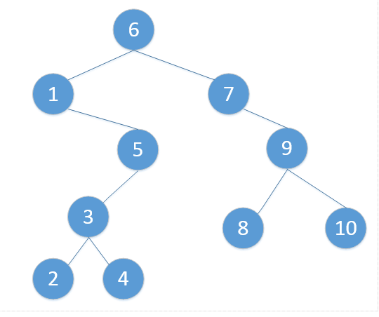

[toc]
# 二叉搜索树
## 定义特性
+ 一棵二叉搜索树（BST）是以一棵二叉树来组织的，可以用链表数据结构来表示，其中，每一个结点就是一个对象，一般地，包含数据内容key和指向孩子（也可能是父母）的指针属性。如果某个孩子结点不存在，其指针属性值为空（NIL）。
+ **二叉搜索树中的关键字key的存储方式总是满足二叉搜索树的性质** 
    > 设x是二叉搜索树中的一个结点。 
      如果y是x左子树中的一个结点，则 y.key<=x.key 
      如果y是x右子树中的一个节点，则 y.key>=x.key
+ 搜索树数据结构支持Search, minimum, maximum, predecessor, successor, insert, delete等

## 示例

## 说明
* 二叉搜索树上的基本操作所花时间与这棵树的高度成正比， 对于有n个结点的一颗完全二叉树来说， 这些操作的最坏运行时间为O(lgn)，一般O(h)

### 二叉搜索树查找：
* 二叉搜索树很多时候用来进行数据查找。这个过程从树的根结点开始，沿着一条简单路径一直向下，直到找到数据或者得到NIL值。

### 前驱结点
1. 若一个节点有左子树，那么该节点的前驱节点是其左子树中val值最大的节点（也就是左子树中所谓的rightMostNode）
2. 若一个节点没有左子树，那么判断该节点和其父节点的关系 
    * 若该节点是其父节点的右边孩子，那么该节点的前驱结点即为其父节点。 
    * 若该节点是其父节点的左边孩子，那么需要沿着其父亲节点一直向树的顶端寻找，直到找到一个节点P，P节点是其父节点Q的右边孩子（可参考例子2的前驱结点是1），那么Q就是该节点的前驱节点
3. 如图说明
   + 4的前驱结点是3
   + 2的前驱结点是1
   + 6的前驱结点是5
   
### 后继结点
1. 若一个节点有右子树，那么该节点的后继节点是其右子树中val值最小的节点（也就是右子树中所谓的leftMostNode）
2. 若一个节点没有右子树，那么判断该节点和其父节点的关系 
    * 若该节点是其父节点的左边孩子，那么该节点的后继结点即为其父节点 
    * 若该节点是其父节点的右边孩子，那么需要沿着其父亲节点一直向树的顶端寻找，直到找到一个节点P，P节点是其父节点Q的左边孩子（可参考例子4的后继结点是5），那么Q就是该节点的后继节点
3. 如图说明
   + 7的后继结点是8
   + 5的后继节点是6
   + 2的后继节点是3
   
### 插入
* BST的插入过程非常简单，很类似与二叉树搜索树的查找过程。当需要插入一个新结点时，从根节点开始，迭代或者递归向下移动，直到遇到一个空的指针NIL，需要插入的值即被存储在该结点位置。这里给出迭代插入算法，递归方式的比较简单。

### 删除
二叉搜索树的结点删除比插入较为复杂，总体来说，结点的删除可归结为三种情况：
1. 如果结点z没有孩子节点，那么只需简单地将其删除，并修改父节点，用NIL来替换z；
2. 如果结点z只有一个孩子，那么将这个孩子节点提升到z的位置，并修改z的父节点，用z的孩子替换z；
3. 如果结点z有2个孩子，那么查找z的后继y，此外后继一定在z的右子树中，然后让y替换z。
    * 如果y是z的右孩子，那么用y替换z, 并仅留下y的右孩子
    * 如果y不是z的右孩子，那么先用y的右孩子替换y, 再用y替换z。
 

## 参考
- [看图轻松理解数据结构与算法系列(二叉搜索树)](https://juejin.im/post/5b60fd59f265da0f8d3675c5)
- [深入理解二叉搜索树（BST）](https://blog.csdn.net/u013405574/article/details/51058133)
- [Golang 数据结构：二叉搜索树](https://wuyin.io/2018/02/05/golang-data-structure-binary-search-tree/)
- [GO DATA STRUCTURES: BINARY SEARCH TREE](https://flaviocopes.com/golang-data-structure-binary-search-tree/)
- [二叉查找树的前驱后继](https://www.cnblogs.com/Renyi-Fan/p/8252227.html)