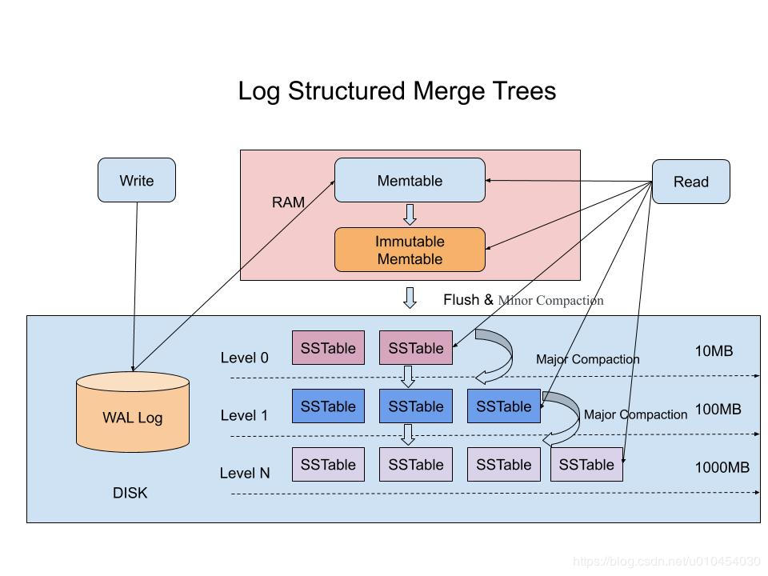

## lsm_tree 知识点汇总

## 什么是LSM-Tree
- LSM-Tree全称是Log Structured Merge Tree，是一种分层，有序，面向磁盘的数据结构;
- 其核心思想是充分了利用了，磁盘批量的顺序写要远比随机写性能高出很多;
- 虽然这种结构的写非常简单高效，但其缺点是对读取特别是随机读很不友好，这也是为什么日志通常用在下面的两种简单的场景：
    + 数据是被整体访问的，大多数数据库的WAL（write ahead log）也称预写log，包括mysql的Binlog等
    + 数据是通过文件的偏移量offset访问的，比如Kafka。

## SSTable 和 LSM-Tree
- SSTable是一种拥有持久化，有序且不可变的的键值存储结构，它的key和value都是任意的字节数组，并且了提供了按指定key查找和指定范围的key区间迭代遍历的功能
- SSTable内部包含了一系列可配置大小的Block块，典型的大小是64KB，关于这些Block块的index存储在SSTable的尾部，用于帮助快速查找特定的Block
- 当一个SSTable被打开的时候，index会被加载到内存，然后根据key在内存index里面进行一个二分查找，查到该key对应的磁盘的offset之后，然后去磁盘把响应的块数据读取出来
- 当然如果内存足够大的话，可以直接把SSTable直接通过MMap的技术映射到内存中，从而提供更快的查找。 

## 在LSM-Tree里面如何写数据?
- 当收到一个写请求时，会先把该条数据记录在WAL Log里面，用作故障恢复
- 当写完WAL Log后，会把该条数据写入内存的SSTable里面（删除是墓碑标记，更新是新记录一条的数据），也称Memtable。注意为了维持有序性在内存里面可以采用红黑树或者跳跃表相关的数据结构。
- 当Memtable超过一定的大小后，会在内存里面冻结，变成不可变的Memtable，同时为了不阻塞写操作需要新生成一个Memtable继续提供服务。
- 把内存里面不可变的Memtable给dump到到硬盘上的SSTable层中，此步骤也称为Minor Compaction，这里需要注意在L0层的SSTable是没有进行合并的，所以这里的key range在多个SSTable中可能会出现重叠，在层数大于0层之后的SSTable，不存在重叠key。
- 当每层的磁盘上的SSTable的体积超过一定的大小或者个数，也会周期的进行合并。此步骤也称为Major Compaction，这个阶段会真正 的清除掉被标记删除掉的数据以及多版本数据的合并，避免浪费空间，注意由于SSTable都是有序的，我们可以直接采用merge sort进行高效合并

## 在LSM-Tree里面如何查数据?
- 当收到一个读请求的时候，会直接先在内存里面查询，如果查询到就返回。
- 如果没有查询到就会依次下沉，知道把所有的Level层查询一遍得到最终结果。

### 思考查询步骤，我们会发现如果SSTable的分层越多，那么最坏的情况下要把所有的分层扫描一遍，对于这种情况肯定是需要优化的，如何优化？
- 压缩
SSTable 是可以启用压缩功能的，并且这种压缩不是将整个 SSTable 一起压缩，而是根据 locality 将数据分组，每个组分别压缩，这样的好处当读取数据的时候，我们不需要解压缩整个文件而是解压缩部分 Group 就可以读取。
- 缓存
因为SSTable在写入磁盘后，除了Compaction之外，是不会变化的，所以我可以将Scan的Block进行缓存，从而提高检索的效率
- 索引，Bloom filters
正常情况下，一个读操作是需要读取所有的 SSTable 将结果合并后返回的，但是对于某些 key 而言，有些 SSTable 是根本不包含对应数据的，因此，我们可以对每一个 SSTable 添加 Bloom Filter，因为布隆过滤器在判断一个SSTable不存在某个key的时候，那么就一定不会存在，利用这个特性可以减少不必要的磁盘扫描。
- 合并
这个在前面的写入流程中已经介绍过，通过定期合并瘦身， 可以有效的清除无效数据，缩短读取路径，提高磁盘利用空间。但Compaction操作是非常消耗CPU和磁盘IO的，尤其是在业务高峰期，如果发生了Major Compaction，则会降低整个系统的吞吐量，这也是一些NoSQL数据库，比如Hbase里面常常会禁用Major Compaction，并在凌晨业务低峰期进行合并的原因

## B+Tree VS LSM-Tree
- LSM-Tree的设计思路是，将数据拆分为几百M大小的Segments，并是顺序写入。
- B+Tree则是将数据拆分为固定大小的Block或Page, 一般是4KB大小，和磁盘一个扇区的大小对应，Page是读写的最小单位。
- 在数据的更新和删除方面，B+Tree可以做到原地更新和删除，这种方式对数据库事务支持更加友好，因为一个key只会出现一个Page页里面，但由于LSM-Tree只能追加写，并且在L0层key的rang会重叠，所以对事务支持较弱，只能在Segment Compaction的时候进行真正地更新和删除。
- LSM-Tree的优点是支持高吞吐的写（可认为是O（1）），这个特点在分布式系统上更为看重，当然针对读取普通的LSM-Tree结构，读取是O（N）的复杂度，在使用索引或者缓存优化后的也可以达到O（logN）的复杂度。
- B+tree的优点是支持高效的读（稳定的OlogN），但是在大规模的写请求下（复杂度O(LogN)），效率会变得比较低，因为随着insert的操作，为了维护B+树结构，节点会不断的分裂和合并。操作磁盘的随机读写概率会变大，故导致性能降低。

## 参考
- [深入理解什么是LSM-Tree](https://blog.csdn.net/u010454030/article/details/90414063)
- [我爱造轮子 – 基于LSM tree实现的kv数据库](https://www.gogodjzhu.com/201911/kv-database-keydb/)
- [深入理解什么是LSM-Tree](https://cloud.tencent.com/developer/article/1441835)
- [LSM Tree/MemTable/SSTable基本原理](https://www.jianshu.com/p/7c62e5f3b24b)
- [详解SSTable结构和LSMTree索引](https://blog.csdn.net/weixin_34378767/article/details/85512800?depth_1-utm_source=distribute.pc_relevant.none-task&utm_source=distribute.pc_relevant.none-task)
- [LSM Tree 学习笔记](http://blog.fatedier.com/2016/06/15/learn-lsm-tree/)
- [lsm-tree](https://zhuanlan.zhihu.com/p/38810568)
- [实现](https://github.com/alanpx/learn/blob/master/go/algorithm/lsm.go)
- [日志结构的合并树 The Log-Structured Merge-Tree](http://www.cnblogs.com/siegfang/archive/2013/01/12/lsm-tree.html)