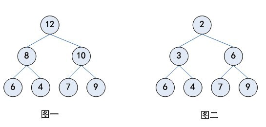
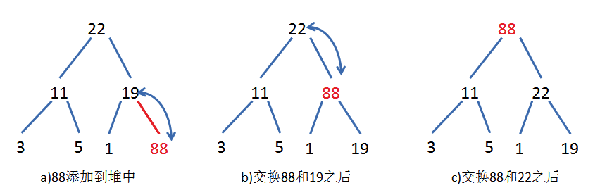
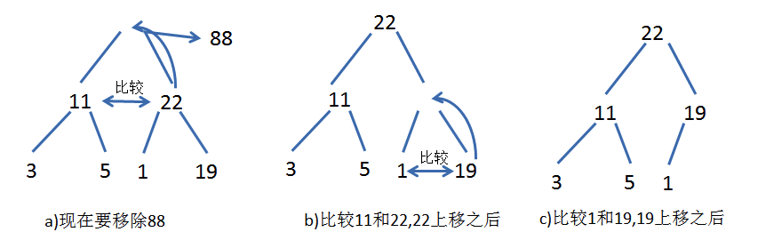

[toc]

# 堆
什么是最大堆呢？最大堆任何一个父节点的值，都大于等于它左右孩子节点的值
什么是最小堆呢？最小堆任何一个父节点的值，都小于等于它左右孩子节点的值。

## 概述
堆（heap）也被称为优先队列（priority queue）。
队列中允许的操作是先进先出（FIFO），在队尾插入元素，在队头取出元素。
而堆也是一样，在堆底插入元素，在堆顶取出元素，但是堆中元素的排列不是按照到来的先后顺序，
而是按照一定的优先顺序排列的。这个优先顺序可以是元素的大小或者其他规则。
如图一所示就是一个堆，堆优先顺序就是大的元素排在前面，小的元素排在后面，这样得到的堆称为最大堆。
最大堆中堆顶的元素是整个堆中最大的，并且每一个分支也可以看成一个最大堆。
同样的，我们可以定义最小堆，如图二所示 

## 堆的存储
堆可以看成一个二叉树，所以可以考虑使用二叉树的表示方法来表示堆。
但是因为堆中元素按照一定的优先顺序排列，因此可以使用更简单的方法——数组——来表示，
这样可以节省子节点指针空间，并且可以快速访问每个节点。
堆得数组表示其实就是堆层级遍历的结果 

### 插入
堆还可以看成一个完全二叉树，每次总是先填满上一层，再在下一层从左往右依次插入。堆的插入步骤：
  
1. 将新元素增加到堆的末尾
2. 按照优先顺序，将新元素与其父节点比较，如果新元素小于父节点则将两者交换位置。
3. 不断进行第2步操作，直到不需要交换新元素和父节点，或者达到堆顶
4. 最后通过得到一个最小堆
5. 通过将新元素与父节点调整交换的操作叫做上滤(percolate up)。

### 删除
堆的删除操作与插入操作相反，插入操作从下往上调整堆，而删除操作则从上往下调整堆。

1. 删除堆顶元素（通常是将堆顶元素放置在数组的末尾）
2. 比较左右子节点，将小的元素上调。
3. 不断进行步骤2，直到不需要调整或者调整到堆底。
上述调整的方法称为下滤（percolate down）。

## 参考
- [数据结构-堆（heap）](https://blog.csdn.net/juanqinyang/article/details/51418629)
- [二叉堆](https://mp.weixin.qq.com/s/cq2EhVtOTzTVpNpLDXfeJg)
- [Go语言标准库堆(heap)封装及堆排序实现](https://studygolang.com/articles/3719)